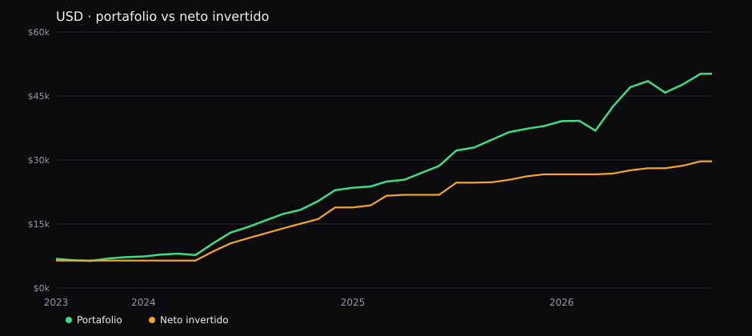
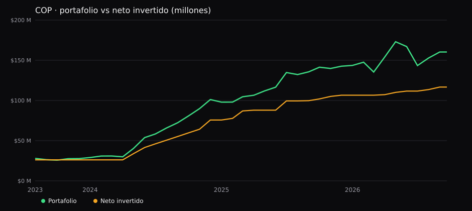

# Portafolio vs TRM

Cuenta eToro de Alejo. Agosto 2023 – 21 septiembre 2026.

**El peso se revalorizó. El portafolio, también.**

La TRM bajó de ~4.030 a **3.193** (pico 4.478 en nov-2024). En dólares el resultado es +69%. En pesos, después del lastre del FX, sigue en **+37%**.

| | USD | COP |
|---|---|---|
| Valor hoy | **$50.209** | **$160 M** |
| Neto invertido | **$29.674** | **$117 M** |
| Retorno simple | **+69,2%** | **+37,4%** |
| XIRR | **30,7%** | **17,6%** |

## Gráficos

Dólares vs TRM:



En pesos:



Notebook con los PNG: [portafolio_vs_trm.ipynb](portafolio_vs_trm.ipynb)

## Qué hay en el repo

```
README.md
portafolio_vs_trm.ipynb
images/usd_vs_trm.svg
images/usd_vs_trm.png
images/cop.svg
images/cop.png
```

Solo cuenta Alejo. Sin Cindy ni Hapi. Rentabilidades pasadas no garantizan resultados futuros.
